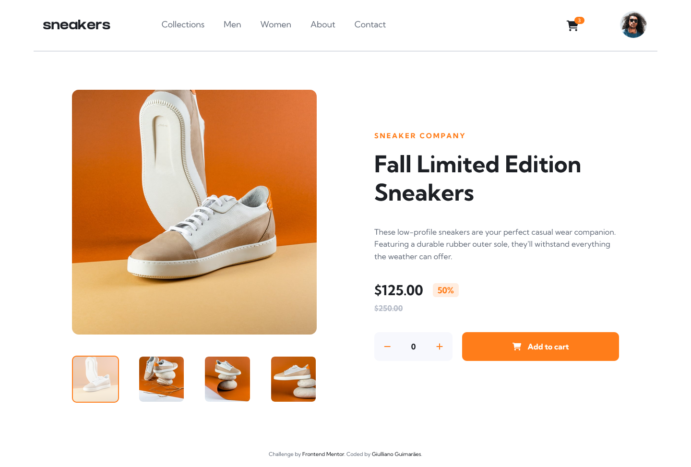
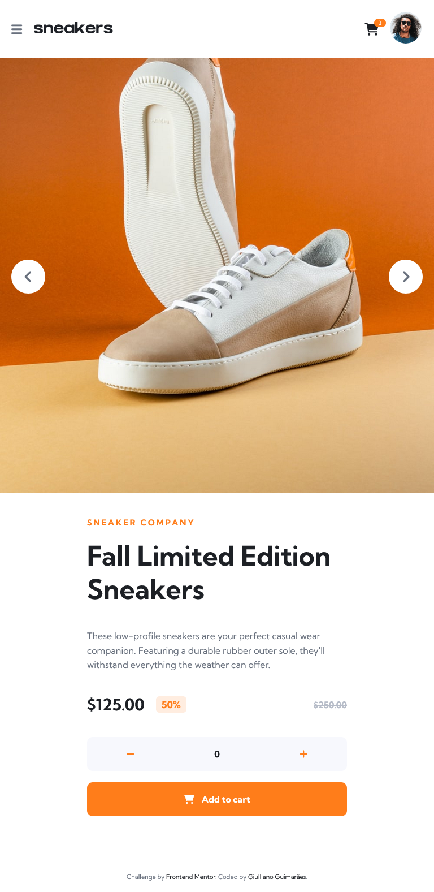
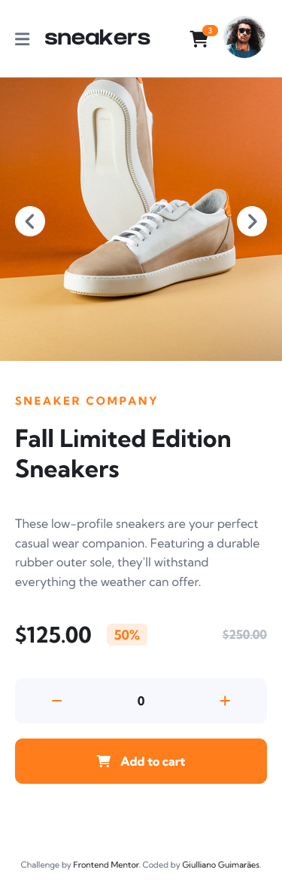

# Frontend Mentor - E-commerce product page

Este projeto é um desafio da plataforma [Frontend Mentor](https://www.frontendmentor.io/challenges/ecommerce-product-page-UPsZ9MJp6), que consiste na simulação de uma página de apresentação de produtos de um e-commerce. A página é responsiva: se adapta a diferenres tamanhos de tela conforme o dispositivo em que é visualizado.

Nesta página consta informações do produto, como imagens navegáveis, descrição do produto, informações de preço e ação para compra.

Além disso, a página apresenta elementos de cabeçalho, como área do logo, menu e links que direcionam para área de perfil e de compras.

## Layout do projeto construído

*Captura de tela em 1440px*

---

*Captura de tela em 768px*

---

*Captura de tela em 375px*

---

## Ferramentas e tecnologias utilizadas

Para este projeto foi utilizado as seguintes ferramentas:
 - HTML 5
 - CSS 3
 - Sass
 - JavaScript

 ## Instalação

 Para instalar os arquivos no computador e visualizar o projeto, é recomendável utilizar o Visual Studio Code e habilitar as extensões Live Server e Live Sass Compiler.